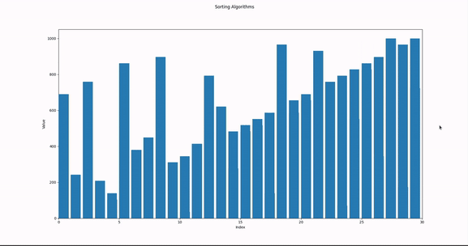
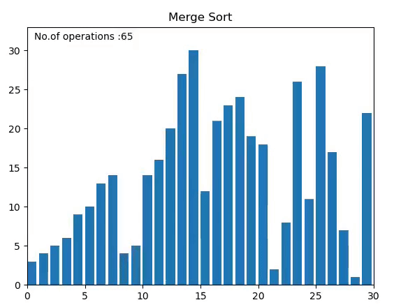

# Sorting-Visualizer
Sorting visualizer animation created using python libraries like matplotlib and numpy

# Output of main
This file contains visualization of bubble sort  

  
# Output of mergesort
This file contains visualization of merge sort  

